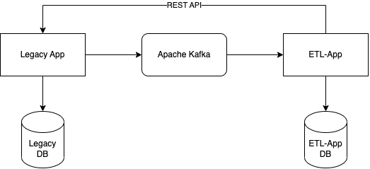
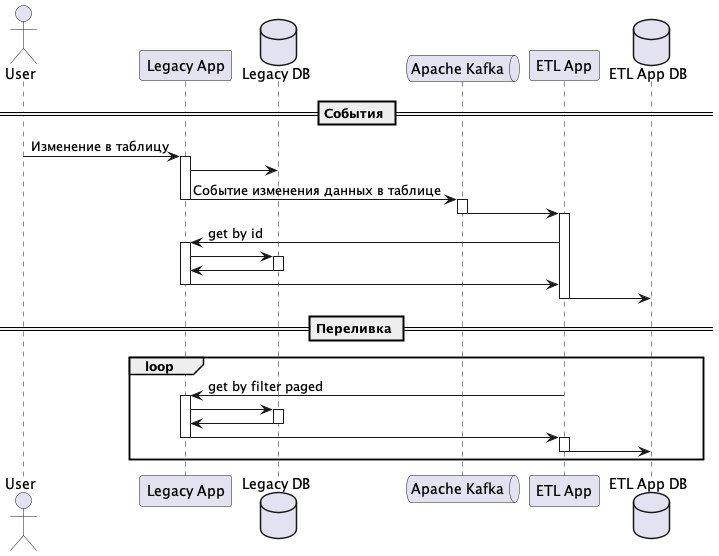

Легенда:
Есть некая легаси система в которой имеются записи в таблице начиная с 2013 года. Легаси система довольно таки
медленная. Но поскольку нам нужны данные из этой таблицы, а легаси система долго отвечает, наш гениальный архитектор
решил, что нам нужны локальная частичная копия этой таблицы, чтобы повысить производительность нашей системы. Поскольку
наша система новая и у нее клевая событийная архитектура, было решено попросить разработчиков легаси системы отправлять
события изменений по таблице в кафку, а саму таблицу выгрузить через Kafka Connect.

После долгих переговоров оказалось, что легаси система это монолит из спагетти-кода и выгружать данные в кафку не
получится, максимум получится через костыли уведомить только о факте события с айдишником из таблицы. Так же оказалось
что прямого доступа к базе данных не будет, так как безопасники очень злые ребята и все запретили, мол система очень
важная и всякие данные конфиденциальные лежат рядом. В итоге был придуман обходной вариант: факт события с айдишником
будет отправляться в кафку, а данные можно будет получить через публичное REST API. Через это же апи можно получить все
данные таблицы постранично. Реализовать данную функциональность выпало тебе, дружок.

Задача:
• Создать 2 микросервиса (legacy-app и etl-app)
• В качестве бд использовать postgresql
• Для каждого приложения создать свою базу данных внутри postgresql
• legacy-app:
o Реализовать REST API для постраничного поиска по таблице с фильтрацией
o Реализовать REST API поиска по Id
o Выгружать событие в топик кафки при изменении данных
• etl-app:
o Слушать топик кафки с событиями по таблице
o Получать данные через REST API при получении события и сохранять их в базу данных
o Запустить переливку данных через REST API в назначенную дату

Требования к переливаемым данным:
Аналитик: "Для нашей системы нужны данные у которых type = TYPE4 и TYPE5. Эти типы появились появились в марте 2020
года, раньше их небыло, это стоит учесть при изначальной переливке».

Требования к заданию:
Код необходимо выложить на GitHub
Окружение можно развернуть в docker-compose
Снабдить код тестами демострирующими работоспособность функционала как изолированно так и в полной интеграции

Требования к техстеку:
• Java 17
• Spring Boot 3

Схема таблицы:

id bigserial
type text
// возможные типы: TYPE1, TYPE2, TYPE3, TYPE4, TYPE5, TYPE6, TYPE7
business_value
text
created_at
timestamp
updated_at
timestamp

Схема события в топике:

{
«id»: 1234567890 // long айдишник в таблице
«action»: «CREATE», // строка-енам возможны виды: CREATE, UPDATE, DELETE
«eventTime»: 1234567890
// long unix-time
}

